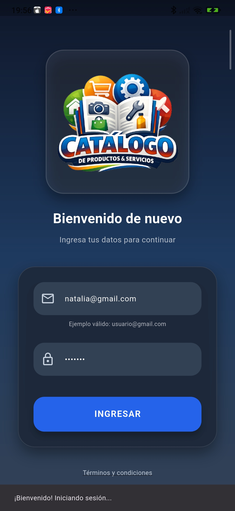
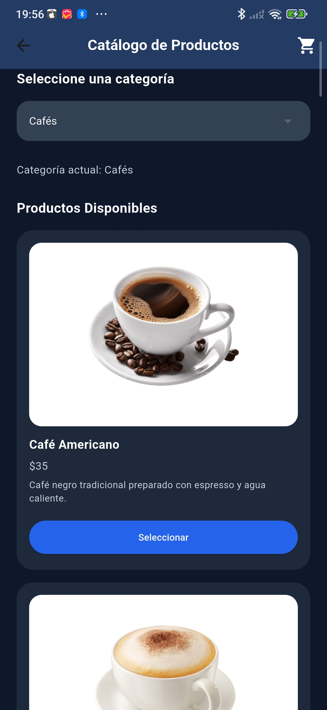

# INICIO: EL PARADIGMA DE EVENTOS

Este proyecto parte del diseño previo de una pantalla de **Login** desarrollada en Flutter. En esta primera versión, la interfaz únicamente mostraba elementos visuales sin ninguna funcionalidad.

En este punto se introduce el concepto de **paradigma de eventos**, donde la aplicación permanece en espera hasta que el usuario realiza una acción, como presionar un botón, escribir en un campo o seleccionar una opción. A partir de estos eventos, la aplicación responde ejecutando acciones específicas.

## Evento de clic (botón “Ingresar”)

Cuando el usuario presiona el botón **“Ingresar”**, se activa el proceso de inicio de sesión.

El sistema realiza lo siguiente:
- Captura los datos ingresados en correo y contraseña.
- Verifica que la información esté completa.
- Valida que el formato del correo sea correcto.

Si todo es correcto, se muestra un mensaje temporal en pantalla (SnackBar):

> “¡Bienvenido! Iniciando sesión…”

## Validación de campos vacíos

Si el usuario intenta continuar sin completar alguno de los campos, el sistema bloquea el acceso y muestra un aviso como:

> “Por favor, complete todos los campos.”

##  Validación del formato del correo

El sistema valida que el correo electrónico tenga un formato correcto.

Requisitos:
- Debe incluir el símbolo **@**

Si no cumple, se muestra el mensaje:

> “El correo debe contener @”

## Términos y condiciones

Al seleccionar la opción **“Términos y condiciones”**, se muestra una ventana emergente (AlertDialog) con información importante.

Incluye:
- Texto informativo
- Botón **“Aceptar”** para cerrar la ventana

## Acceso al catálogo de productos

Después de un inicio de sesión correcto, el usuario accede al catálogo de productos.

Se muestran:
- Aproximadamente 5 categorías
- Productos organizados por categoría

Cada producto incluye:
- Nombre
- Precio
- Descripción
- Imagen
- Botón de “Seleccionar”

## Carrito de compras

Al seleccionar un producto, este se agrega automáticamente al carrito de compras.

El carrito muestra:
- Productos seleccionados
- Total acumulado

Este comportamiento se mantiene en todas las categorías.

## Tecnologías utilizadas

- Flutter  
- Dart  
- Visual Studio Code  
- Android Studio  

## Estructura del proyecto

El archivo principal se encuentra en:  lib/main.dart
